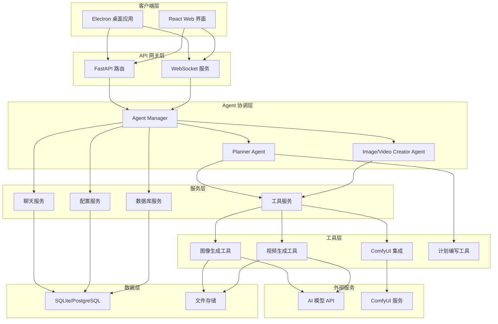
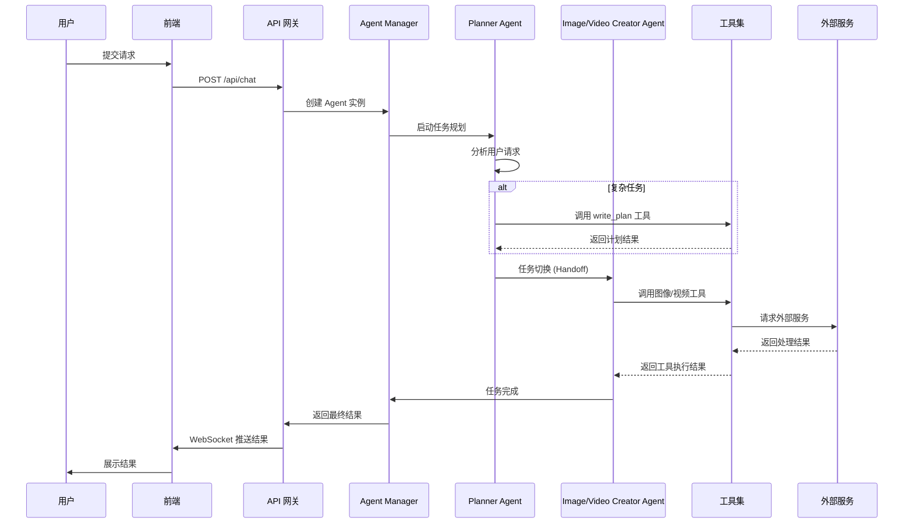
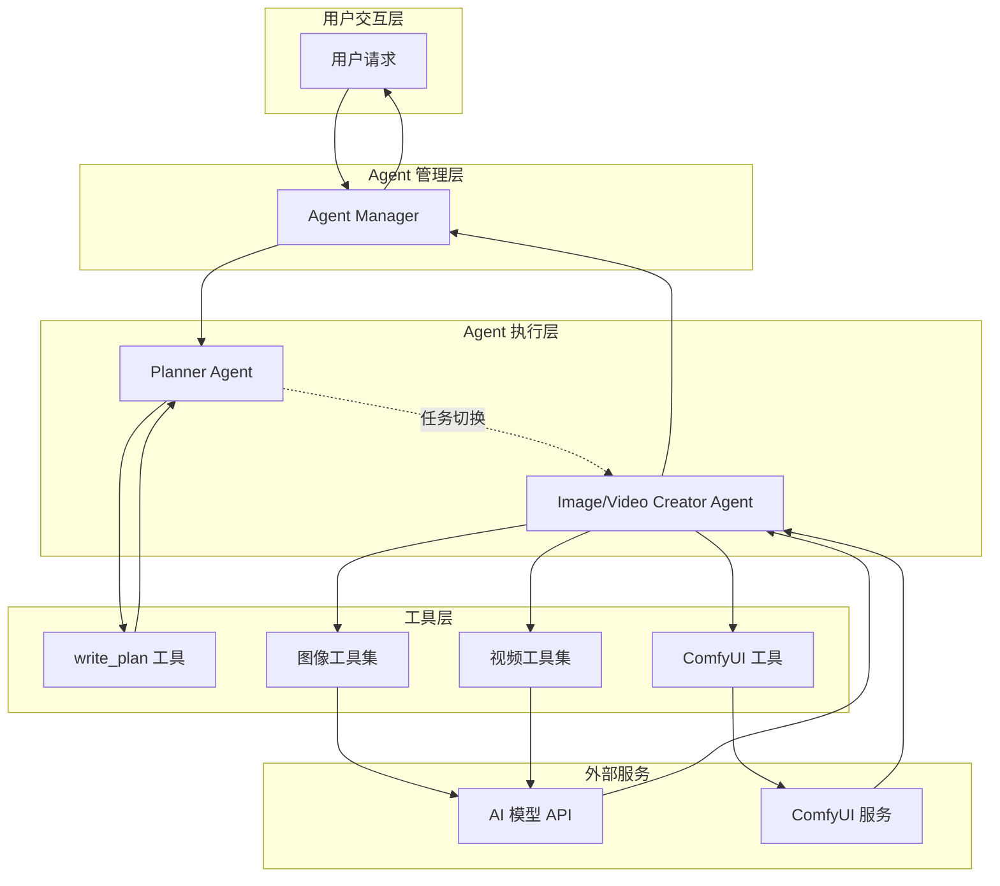

# Jaaz - AI Agent 协作平台

## 项目概述

Jaaz 是一个基于多 Agent 协作的 AI 应用平台，专注于图像和视频的智能生成与编辑。该项目采用先进的多 Agent 架构，通过任务规划、工具调用和实时反馈机制，为用户提供高效、透明的 AI 创作体验。

## 功能特性

- **多 Agent 协作系统**：基于 LangGraph 框架的智能体协作平台
- **任务智能规划**：自动将复杂任务分解为可执行的子任务
- **多样化工具集成**：支持多种图像和视频生成模型（Flux、Midjourney、Ideogram 等）
- **实时状态反馈**：通过 WebSocket 提供任务执行过程的实时可视化
- **ComfyUI 集成**：集成 ComfyUI 工作流，支持自定义图像生成流程
- **跨平台支持**：基于 Electron 的桌面应用，支持 Windows、macOS 和 Linux

## 技术栈

### 前端
- **React**：现代化用户界面框架
- **TypeScript**：类型安全的 JavaScript 超集
- **Electron**：跨平台桌面应用框架
- **Socket.IO Client**：实时通信客户端

### 后端
- **Python**：核心后端语言
- **FastAPI**：高性能异步 Web 框架
- **LangGraph**：多 Agent 协作框架
- **Socket.IO**：实时双向通信协议
- **SQLite/PostgreSQL**：数据持久化存储

### AI/ML 集成
- **ComfyUI**：节点式 AI 图像生成界面
- **多种 AI 模型**：Flux、Midjourney、Ideogram、GPT-Image、Imagen 等
- **视频生成**：Hailuo、Kling、Seedance、Veo3 等

## 系统架构

### 整体架构图



### Agent 协作架构



## Agent 协作机制

### Agent 协作流程图



### Agent 协作详细流程图


### 1. Agent Manager

Agent Manager 是整个 Agent 系统的核心协调者，负责：
- 创建和管理所有 Agent 实例
- 根据任务类型分配合适的工具
- 处理 Agent 之间的任务切换

### 2. Planner Agent

Planner Agent 是任务规划的核心，负责：
- 分析用户请求，理解任务意图
- 将复杂任务分解为可执行的子任务
- 制定详细的执行计划
- 将任务移交给专门的执行 Agent

### 3. Image/Video Creator Agent

Image/Video Creator Agent 是专门负责媒体内容生成的 Agent，具有：
- 丰富的图像和视频生成工具
- 多种 AI 模型的调用能力
- 参数优化和结果筛选功能

## 任务规划流程

1. **任务接收**：系统接收用户请求，启动 Planner Agent
2. **任务分析**：Planner Agent 分析请求，判断任务复杂度
3. **计划制定**：对于复杂任务，调用 write_plan 工具制定执行计划
4. **任务分配**：根据任务类型，将子任务分配给相应的专门 Agent
5. **任务执行**：专门 Agent 调用相应工具执行任务
6. **结果汇总**：将各子任务的结果汇总，形成最终输出
7. **状态反馈**：通过 WebSocket 实时向前端反馈执行状态

## 工具调用机制

### 工具分类

- **系统工具**：如 write_plan，用于任务规划和状态管理
- **图像生成工具**：集成多种图像生成模型，如 Flux、Midjourney 等
- **视频生成工具**：集成多种视频生成模型，如 Hailuo、Kling 等
- **ComfyUI 工具**：与 ComfyUI 服务交互，执行自定义工作流

### 工具调用流程

1. Agent 根据任务需求选择合适的工具
2. 工具服务验证工具可用性和参数
3. 工具服务调用外部 API 或本地服务
4. 处理返回结果，进行必要的格式转换
5. 将结果返回给 Agent，供后续决策使用

## 前后端交互

### HTTP API 交互

- **POST /api/chat**：提交聊天请求，触发 Agent 任务
- **POST /api/cancel/{session_id}**：取消正在执行的任务
- **POST /api/magic**：提交特殊生成请求
- **GET /api/config**：获取系统配置信息

### WebSocket 实时通信

- **连接建立**：前端与后端建立持久 WebSocket 连接
- **状态推送**：后端实时推送 Agent 执行状态、工具调用结果
- **进度反馈**：长时任务的进度信息实时更新
- **错误处理**：执行过程中的错误信息及时反馈

## 部署指南

### 环境要求

- Python 3.8+
- Node.js 16+
- npm 或 yarn
- ComfyUI (可选，用于本地图像生成)

### 后端部署

1. 克隆项目仓库
```bash
git clone https://github.com/your-org/jaaz.git
cd jaaz
```

2. 安装 Python 依赖
```bash
cd server
pip install -r requirements.txt
```

3. 配置环境变量
```bash
cp .env.example .env
# 编辑 .env 文件，填入必要的 API 密钥和配置
```

4. 初始化数据库
```bash
python -m services.migrations.manager
```

5. 启动后端服务
```bash
python main.py
```

### 前端部署

1. 安装 Node.js 依赖
```bash
cd react
npm install
```

2. 启动开发服务器
```bash
npm run dev
```

### 桌面应用构建

1. 构建前端资源
```bash
cd react
npm run build
```

2. 构建桌面应用
```bash
npm run electron:build
```

## 贡献指南

我们欢迎社区贡献！请遵循以下步骤：

1. Fork 项目仓库
2. 创建功能分支 (`git checkout -b feature/amazing-feature`)
3. 提交更改 (`git commit -m 'Add some amazing feature'`)
4. 推送到分支 (`git push origin feature/amazing-feature`)
5. 创建 Pull Request

### 代码规范

- Python 代码遵循 PEP 8 规范
- TypeScript/React 代码使用 ESLint 和 Prettier 进行格式化
- 提交信息使用约定式提交格式

### 测试

- 确保所有测试通过后再提交 PR
- 为新功能添加相应的单元测试
- 集成测试覆盖关键业务流程

## 许可证

本项目采用 MIT 许可证 - 查看 [LICENSE](LICENSE) 文件了解详情。

## 联系我们

- 项目主页：https://github.com/your-org/jaaz
- 问题反馈：https://github.com/your-org/jaaz/issues
- 邮箱：contact@jaaz.com

---

感谢您对 Jaaz 项目的关注和支持！